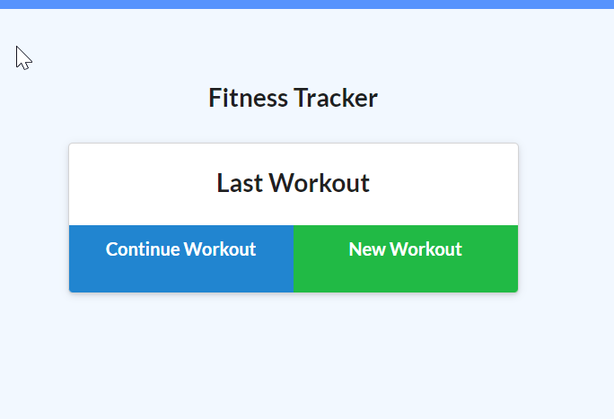

# workout_tracker

## Description
This project was designed to practice the use of mongodb and mongoose to store information about the user's workout, and to do some math operations with said data to show the user an aggregate total of their workouts. 
## Table of Contents (Optional)
If your README is long, add a table of contents to make it easy for users to find what they need.
- [Installation](#installation)
- [Usage](#usage)
- [Credits](#credits)
## Installation
The app can be found in this [GitHub repositiory](https://github.com/jmarq019/workout_tracker) and deployed [here](https://jorge-workout-tracker.herokuapp.com/), on heroku.
## Usage
The app is used by clicking through the buttons to save a workout

## Credits
Credits to the UW coding bootcamp instructional team and to the [MongoDB documentation](https://docs.mongodb.com/)
## Tests
Gesting was done by using the app directly.